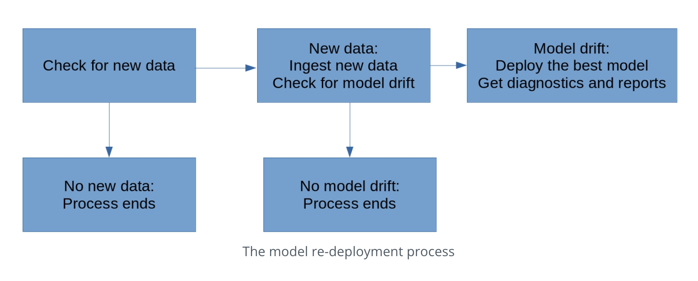

## Dynamic-Risk-Assessment-System
Create, deploy, and monitor a risk assessment ML model that will estimate the attrition risk of each of the company's 10,000 clients.

## Project Structure
```
LICENSE
README.md
apicalls.py
app.py
config.json
cronjob.txt
deployment.py
diagnostics.py
fullprocess.py
ingesteddata
   |-- finaldata.csv
   |-- ingestedfiles.txt
ingestion.py
models
   |-- apireturns2.txt
   |-- confusionmatrix2.png
   |-- latestscore.txt
   |-- trainedmodel.pkl
practicedata
   |-- Icon\r"
   |-- dataset1.csv
   |-- dataset2.csv
practicemodels
   |-- apireturns.txt
   |-- confusionmatrix.png
   |-- latestscore.txt
   |-- trainedmodel.pkl
production_deployment
   |-- ingestedfiles.txt
   |-- latestscore.txt
   |-- trainedmodel.pkl
reporting.py
requirements.txt
scoring.py
sourcedata
   |-- Icon
   |-- dataset3.csv
   |-- dataset4.csv
testdata
   |-- Icon
   |-- testdata.csv
training.py
wsgi.py
```

## Environment Set up
- This dependencies requirement is in the requirements.txt file.
- Install the dependencies using pip:
```
pip install -r requirements.txt
```

## Steps
- Data ingestion: Data ingestion is important because all ML models require datasets for training. Instead of using a single, static dataset, you're going to create a script that's flexible enough to work with constantly changing sets of input files. This step will make your data ingestion go smoothly and easily, even if the data itself is complex. In this step, you'll read data files into Python, and write them to an output file that will be your master dataset. You'll also save a record of the files you've read.

- Training, Scoring, and Deploying an ML Model: ML models are only worth deploying if they've been trained, and we're always interested in re-training in the hope that we can improve our model accuracy. Re-training and scoring, as we'll do in this step, are crucial so we can get the highest possible model accuracy.

- Model and Data Diagnostics: Model and data diagnostics will help us find problems - if any exist - in our model and data. Finding and understanding any problems that might exist will help us resolve the problems quickly and make sure that our model performs as well as possible.

- Reporting: Model reporting allows us as data scientists to be aware of all aspects of our data, our model, and our training processes, as well as their performance. Also, automated reporting enables us to keep stakeholders and leaders quickly and reliably informed about our ML efforts.

- Process Automation: Process automation will eliminate the need for us to manually perform the individual steps of the ML model scoring, monitoring, and re-deployment process. This step includes checking for the criteria that will require model re-deployment, and re-deploying models as necessary.

- The full process that you'll automate is shown in the following figure:



## Cron Job
Run the fullprocess.py script one time every 10 min.
- In the command line, run the following command: service cron start
- Open crontab file by running crontab -e in command line. Your workspace may ask you which text editor you want to use to edit the crontab file. You can select option 3, which corresponds to the "vim" text editor.
- When you're using vim to edit the crontab, you need to press the "i" key to be able to insert a cron job.
- After you write the cron job in the crontab file, you can save your work and exit vim by pressing the escape key, and then typing ":wq" , and then press Enter. This will save your one-line cron job to the crontab file and return you to the command line. If you want to view your crontab file after exiting vim, you can run crontab -l on the command line.
